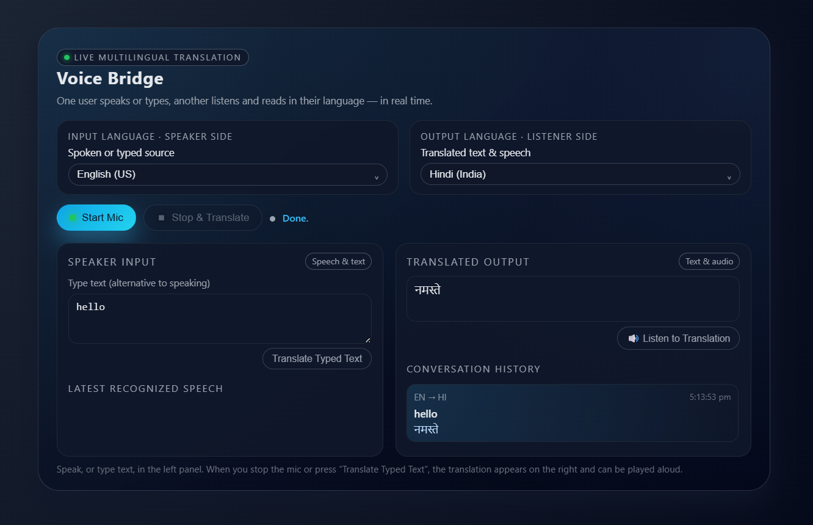

# 🎙️ Voice Bridge - Real-Time Speech & Text Translator

**Voice Bridge** is a powerful web application that bridges language barriers in real-time. It allows users to speak or type in their native language while another person listens or reads the translation instantly.

🚀 **[Live Demo](https://voice-bridge-teal.vercel.app/)**



## ✨ Features

-   **🗣️ Real-Time Speech Recognition**: Speak naturally, and the app converts your voice to text instantly.
-   **⌨️ Text Input**: Option to type text directly for translation.
-   **🌍 Multi-Language Support**: Supports a wide range of languages including English, Hindi, Spanish, French, German, Chinese, and many Indian regional languages.
-   **🔊 Text-to-Speech (TTS)**: Listen to the translated text with high-quality audio playback (using Google Translate TTS).
-   **📜 Conversation History**: Keeps a log of the entire conversation for easy reference.
-   **🎨 Modern UI**: A sleek, dark-themed interface designed for clarity and ease of use.

## 🛠️ Technologies Used

-   **Frontend**: HTML5, CSS3 (Vanilla), JavaScript (ES6+)
-   **Speech-to-Text**: [Web Speech API](https://developer.mozilla.org/en-US/docs/Web/API/Web_Speech_API) (SpeechRecognition)
-   **Translation**: [MyMemory Translation API](https://mymemory.translated.net/)
-   **Text-to-Speech**: Google Translate TTS API (Unofficial)

## 🚀 How to Use

1.  **Clone the Repository**:
    ```bash
    git clone https://github.com/chandana-builds/Voice-Bridge.git
    cd Voice-Bridge
    ```

2.  **Open the App**:
    Simply open the `index.html` file in any modern web browser (Chrome, Edge, or Safari recommended for best speech recognition support).

3.  **Start Translating**:
    -   Select your **Input Language** (Speaker side).
    -   Select your **Output Language** (Listener side).
    -   Click **Start Mic** and speak, or type in the text box.
    -   The app will automatically translate your speech/text.
    -   Click **Listen to Translation** to hear the result.

## 🤝 Contributing

Contributions are welcome! Feel free to open issues or submit pull requests.

## 📄 License

This project is open-source and available under the [MIT License](LICENSE).
